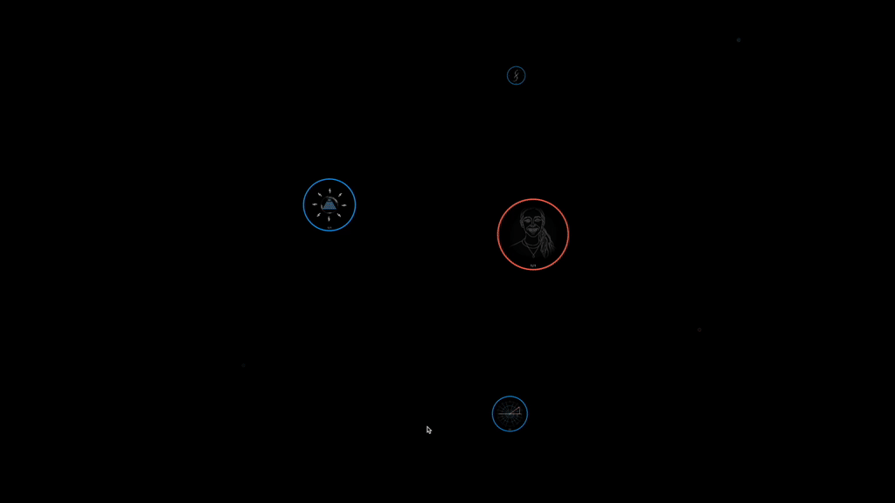
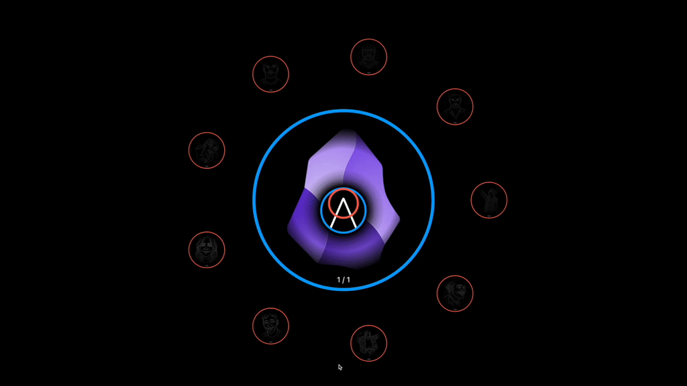

# Project Liminality: from Personal Knowledge Management to Collective Knowledge Gardening

## Introduction

Project Liminality is an innovative knowledge gardening system that aims to revolutionize the way we collectively relate to our stories. It transcends the traditional "second brain" paradigm by introducing the concept of an "interbrain" - a dynamic, relational approach to organizing knowledge as opposed to static, top-down categorisation.

## Core Concepts

### Dream Nodes

The fundamental unit of Project Liminality is the "Dream Node," which is implemented as a Git repository. Dream Nodes can embody two primary concepts:

1. **Dreams**: Abstract ideas, concepts, or any form of knowledge.
2. **Dreamers**: Representations of people or peers.

This dual nature allows for a flexible and interconnected knowledge structure.

### Dream Talk and Dream Song

Each Dream Node consists of two main components:

- **Dream Talk**: A concise, symbolic representation of the idea (like a thumbnail).
- **Dream Song**: A more elaborate explanation or exploration of the idea, containing multiple references to other Dream Talks.

### The Interbrain

Project Liminality structures knowledge based on social relationships and interactions, creating an "interbrain." This approach allows users to organize information along the lines of their actual relational fields, transcending static, top-down categorization.

## Key Features

### Liminal Web

DreamNodes self-organise into your unique "Liminal Web" - an emergent structure of the knowledge you hold and the peers you share it with.
This allows you to navigate your knowledge in an intuitive and organic fashion transcending the need for contrived categorisation or hierarchical management.

### Semantic Search

Finding relevant DreamNodes is made easy and intuitive through semantic search - no need to worry about typos or remembering the exact name of any given idea!
Just enter a search query that is close enough in meaning to what you're looking for and it will magically be revealed.
(This existing feature is the basis for a yet to be implemented realtime conversational copilot that always has the most relevant knowledge at hand for sharing during free flowing conversation)

### DreamWeaving

Just like individual software modules can be combined into more sophisticated projects using git repositories, DreamNodes can be woven together into larger wholes. Using the Obsidian canvas DreamTalk symbols can be woven together with text into DreamSongs. The resulting DreamSong can in turn again be distilled into a single DreamTalk symbol. This reciprocal and recursive many-to-one mapping between DreamSong and DreamTalk allows for the emergence of a vertical holarchy of DreamNodes. A universal pattern for performing the Hegelean Dialectic of ideas in the digital!

### Coherence Beacon

Every time any Dreamer weaves together DreamNodes into larger wholes, the Coherence Beacon is triggered. This mechanism automatically identifies the subset of peers with whom they share any of the input DreamNodes and offers them the higher order DreamNode (including all input DreamNodes they may or may not already hold). By accepting the invitation they extend the signal to all of their peers and so on. This way only coherent ideas spread based on how much they resonate with the network, solving the virality problem. 
Freedom of speech bound by meritocratic reach!

### Conversational Co-Pilot (TBD)

Through realtime transcription of free flowing conversations (video call or in-person) combined with the existing semantic search functionality the system will constantly filter for the most relevant DreamNodes, making them readily available for reference and sharing during the dialogue - all without interrupting the flow! Say goodbye to awkward interruptions due to not finding a reference!
And the best part: referencing a DreamNode (implicitly or explicitly) automatically offers your peer to clone it. Which means sharing an idea and collaborating on it is the same thing in this system.

### Songlines (TBD)

Everytime an idea is shared during a conversation, and thus the corresponding DreamNode is cloned, the relevant clip of the conversation is automatically added to the DreamNode as yet another way of expressing the idea. This way every DreamNode remembers the path it travels in a unique set of conversation clips - its Songline!
Not only do Songlines allow for an organic, decentralised and emergent replacement for static textbook definitions, they also constitute an invaluable source of community-generated and -owned data for representing knowledge in the most effortless yet high bandwidth way. In anticipation of local, multi-modal LLMs with effectively infinite context windows these Songlines may turn out to be a game changer in terms of leveraging collective knowledge and wisdom into actionable projects.

### Integrated AI Assistant

Since DreamNodes are based on git repositories, prominent AI pair-programming solutions like aider or cursor, being optimised for git, integrate seamlessly with the system. And just like the InterBrain generalises git repos from computer code to all of knowledge, the same can be done out of the box with AI pair-programmers, using them as universal magical co-creators!
With ever more powerful, local, multi-modal models on the horizon and deeper integrations through frameworks like Model Context Protocol (MCP) truly the sky is the limit in terms of what can be achieved collectively through the InterBrain!

### Git Client Integration

Easily open any given DreamNode in your favourite git client of your choice.

### Organic Content Visualization

The content within a DreamNode is visually accessible on the backside using the beautiful circle packing algorithm of D3. Instantly access files and folders directly from the InterBrain.

### Finder Integration

Reveal DreamNodes in your file system with just one click

## License

Project Liminality is released under the [GNU AFFERO GENERAL PUBLIC LICENSE](LICENSE).

## Acknowledgements

Much of the philosophical foundation for this project has been created in conversation with my co-visionary and dear friend Anna Ziegler. Check out her one-of-a-kind work at https://goodfairy.gift
